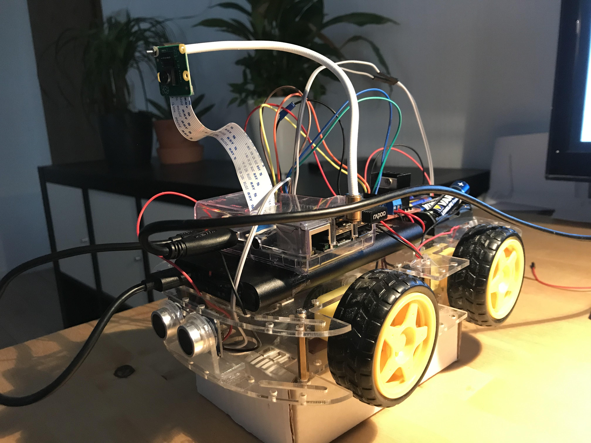
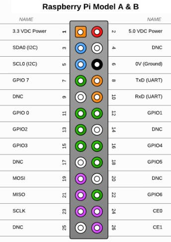

# SASelfDrivingCar

<p align="center">
	
</p>

# Key software components

## Localization

## Perception

## Navigation

# Setup

## Software

```
sudo apt-get install python-tk
pip install opencv-python
pip install picamera
```

## Hardware

### Raspberry Pi

<p align="center">
	
</p>

Follow https://www.hackster.io/bestd25/pi-car-016e66

RED 2  
BLACK 6  
YELLOW 7  
ORANGE 11  
GREEN 13  
BLUE 15  

Use `keyboard_control.py` to drive around the car with the keyboard.

### Camera

Follow https://www.pyimagesearch.com/2015/03/30/accessing-the-raspberry-pi-camera-with-opencv-and-python/  

Followed https://raspberrypi.stackexchange.com/questions/23182/how-to-stream-video-from-raspberry-pi-camera-and-watch-it-live

Run `./remote_livestream.py` 
On your other device run VLC and connect to `rtsp:://IP.OF.RAS.PI::8554`

### Ultrasonics

### Network
https://www.youtube.com/watch?v=bWwZF_zVf00

# Helpful links
* https://www.hackster.io/bestd25/pi-car-016e66  
* https://www.pyimagesearch.com/2015/03/30/accessing-the-raspberry-pi-camera-with-opencv-and-python/  
